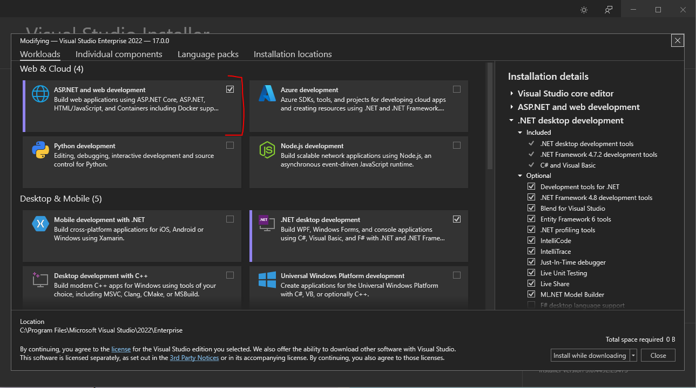
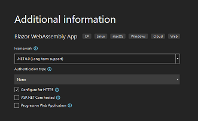

# STAG-AUIUI-AP8VT-2023

_Repository: [https://github.com/Tomas-Juri/STAG-AUIUI-P8VT](https://github.com/Tomas-Juri/STAG-AUIUI-P8VT-2021-2022)_  
_Backend: [https://stag-auiui-p8vt-2021-2022-test.azurewebsites.net](https://stag-auiui-p8vt-2021-2022-test.azurewebsites.net)_  
_Frontend: [https://wonderful-cliff-0c67fd803.1.azurestaticapps.net](https://wonderful-cliff-0c67fd803.1.azurestaticapps.net)_

**Table of contents:**

[1. Lekce 10.02.2023](#1-lekce---10022023)

## 1. Lesson - 10.02.2023
### Presentation:
[](https://slides.com/jiriurban-1/deck/fullscreen)

### Technical Prerequisites:

- [Visual Studio Community](https://visualstudio.microsoft.com/cs/downloads/) with ASP.NET and web development workload
  - This will install an IDE and .NET6 with all necessary packages



### Create Projects and run them

Create an [ASP.NET Web API](https://docs.microsoft.com/en-us/aspnet/core/tutorials/first-web-api?view=aspnetcore-6.0&tabs=visual-studio) in a new solution and

- Use the default configuration
- this will serve as your backend.

Create a [Blazor Application](https://dotnet.microsoft.com/en-us/learn/aspnet/blazor-tutorial/intro) in the same solution

- again use a default config
- this will be your frontend

Setup you visual studio to [debug both project simultaneously](https://stackoverflow.com/questions/3850019/running-two-projects-at-once-in-visual-studio).




### Connect Frontend to Backend

Add [appsettings.json](https://docs.microsoft.com/en-us/aspnet/core/blazor/fundamentals/configuration?view=aspnetcore-6.0) file to your Application.Frontend/wwwroot folder with following content.

```json
{
  "ApiUrl": "https://localhost:7015/"
}
```

Then use this ApiUrl in your HttpClient setup in Application.Frontend/Program.cs

```csharp
var apiUrl = builder.Configuration["ApiUrl"];
if (apiUrl == null)
    throw new ApplicationException("ApiUrl not defined in appsettings.json");

builder.Services.AddScoped(sp => new HttpClient { BaseAddress = new Uri(apiUrl) });
```

Add cors policy to your backend so that you don't get errors on localhost, we get back to them later in the course.

```csharp
app.UseCors(corsPolicyBuilder => corsPolicyBuilder
    .AllowAnyOrigin()
    .AllowAnyMethod()
    .AllowAnyHeader());
```

More about CORS:

- [https://developer.mozilla.org/en-US/docs/Web/HTTP/CORS](https://developer.mozilla.org/en-US/docs/Web/HTTP/CORS)
- [https://docs.microsoft.com/en-us/aspnet/core/security/cors?view=aspnetcore-6.0](https://docs.microsoft.com/en-us/aspnet/core/security/cors?view=aspnetcore-6.0)

Now we can run both apps and test if we really get the data from backend.

_Final code commit of this lecture: **37960e5d8dbdaffad510c929f1e2862e6965c008**_

---