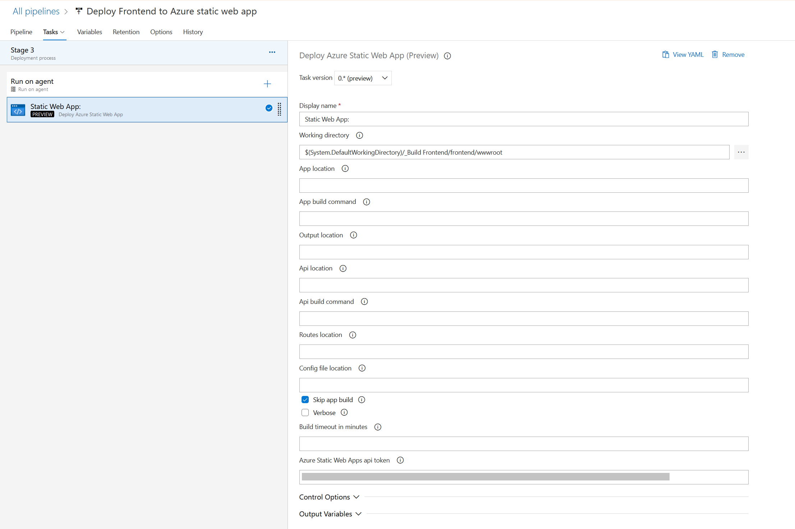
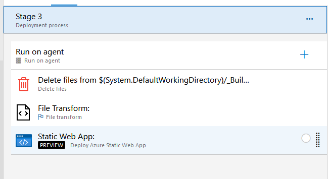

# STAG-AUIUI-P8VT 2022
{: .no_toc }

## Table of contents
{: .no_toc .text-delta }

1. TOC
{:toc}

---

## 1. Lekce - 09.02.2022

### Prerequisites:

- [Visual Studio Community](https://visualstudio.microsoft.com/cs/downloads/) with ASP.NET and web development workload
  - This will install an IDE and .NET6 with all necessary packages


### Create Projects and run them

Create an [ASP.NET Web API](https://docs.microsoft.com/en-us/aspnet/core/tutorials/first-web-api?view=aspnetcore-6.0&tabs=visual-studio) in a new solution and

- Use the default configuration
- this will serve as your backend.

Create a [Blazor Application](https://dotnet.microsoft.com/en-us/learn/aspnet/blazor-tutorial/intro) in the same solution

- again use a default config
- this will be your frontend

Setup you visual studio to [debug both project simultaneously](https://stackoverflow.com/questions/3850019/running-two-projects-at-once-in-visual-studio).


### Connect Frontend to Backend

Add [appsettings.json](https://docs.microsoft.com/en-us/aspnet/core/blazor/fundamentals/configuration?view=aspnetcore-6.0) file to your Application.Frontend/wwwroot folder with following content.

```json
{
  "ApiUrl": "https://localhost:7015/"
}
```

Then use this ApiUrl in your HttpClient setup in Application.Frontend/Program.cs

```csharp
var apiUrl = builder.Configuration["ApiUrl"];
if (apiUrl == null)
    throw new ApplicationException("ApiUrl not defined in appsettings.json");

builder.Services.AddScoped(sp => new HttpClient { BaseAddress = new Uri(apiUrl) });
```

Add cors policy to your backend so that you don't get errors on localhost, we get back to them later in the course.

```csharp
app.UseCors(corsPolicyBuilder => corsPolicyBuilder
    .AllowAnyOrigin()
    .AllowAnyMethod()
    .AllowAnyHeader());
```

More about CORS:

- [https://developer.mozilla.org/en-US/docs/Web/HTTP/CORS](https://developer.mozilla.org/en-US/docs/Web/HTTP/CORS)
- [https://docs.microsoft.com/en-us/aspnet/core/security/cors?view=aspnetcore-6.0](https://docs.microsoft.com/en-us/aspnet/core/security/cors?view=aspnetcore-6.0)

Now we can run both apps and test if we really get the data from backend.

_Final code commit of this lecture: **37960e5d8dbdaffad510c929f1e2862e6965c008**_

---

## 2 Lekce - 16.02.2022

We will create a CI/CD pipeline to deploy our application to a staging server.

### Prerequisites:

- Pushed changes into a repository in azure devops

### Create a build definition using YAML

We will create a build definition for the backend and the frontend separately.

Frontend:

```yaml
trigger:
  branches:
    include:
      - master
  paths:
    include:
      - Application.Frontend

pool:
  vmImage: "windows-latest"

variables:
  buildConfiguration: "Release"

steps:
  - task: UseDotNet@2
    displayName: Use Dotnet 6
    inputs:
      version: "6.0.x"

  - script: dotnet clean
    displayName: "dotnet clean"

  - script: dotnet publish -o $(Build.ArtifactStagingDirectory)
    workingDirectory: Application.Frontend
    displayName: "dotnet publish"

  - task: PublishBuildArtifacts@1
    displayName: "Publish Artifact: drop"
    inputs:
      PathtoPublish: "$(Build.ArtifactStagingDirectory)"
      ArtifactName: "backend"
```

Backend:

```yml
trigger:
  branches:
    include:
      - master
  paths:
    include:
      - Application.Backend

pool:
  vmImage: "windows-latest"

variables:
  buildConfiguration: "Release"

steps:
  - task: UseDotNet@2
    displayName: Use Dotnet 6
    inputs:
      version: "6.0.x"

  - script: dotnet clean
    displayName: "dotnet clean"

  - script: dotnet publish -o $(Build.ArtifactStagingDirectory)
    workingDirectory: Application.Backend
    displayName: "dotnet publish"

  - task: PublishBuildArtifacts@1
    displayName: "Publish Artifact: drop"
    inputs:
      PathtoPublish: "$(Build.ArtifactStagingDirectory)"
      ArtifactName: "backend"
```

### Create a release pipeline in Azure DevOps

To host our applications, we will use [Azure static web app](https://azure.microsoft.com/en-.us/services/app-service/static/#overview) for frontend, and a [Azure app service](https://azure.microsoft.com/cs-cz/services/app-service/#overview) for backend.

To deploy our application, we will create two release pipelines and azure devops (backend & frontend).

Backend:


Frontend:



If we did everything correctly, we should have our application deployed and it should look like this:

- [Backend/WeatheForecast](https://stag-auiui-p8vt-2021-2022-test.azurewebsites.net/weatherforecast)
- [Frontend](https://wonderful-cliff-0c67fd803.1.azurestaticapps.net/)

### Application urls of teams

Meethub Community:

- [Backend](https://meethub-community-api.azurewebsites.net/)
- [Frontend](https://ambitious-forest-0d81ac703.1.azurestaticapps.net)

FixIt:

- [Backend](https://fixit-api.azurewebsites.net/)
- [Frontend](https://black-pebble-018be3b03.1.azurestaticapps.net)

MyBusiness:

- [Backend](https://mybusiness-api.azurewebsites.net)
- [Frontend](https://ashy-river-067e71103.1.azurestaticapps.net)

Why is swagger not running ?  
Why is fetchdata page not working ?
How can i get my release running automagically after a new build ?

More info:

- [YAML](https://yaml.org/)
- [Azure devops pipelines](https://docs.microsoft.com/cs-cz/azure/devops/pipelines/?view=azure-devops)
- [Continuous Integration](https://en.wikipedia.org/wiki/Continuous_integration)
- [Continuous Deployment](https://en.wikipedia.org/wiki/Continuous_deployment)

_Final code commit of this lecture: **cc1596c7960ee1e847d46f151e7fcd1d46e986c0**_

---

## 3. Lekce - 23.02.2022

### Prerequisites:

- Working CI pipeline (build) for Frontend and backend
- Working Release pipeline (deploy) for Frontend and backend - i can see my applications deployed at azure.
- Microsoft SQL Server - [Download here](https://www.microsoft.com/cs-cz/sql-server/sql-server-downloads) Developer version
- Microsoft SQL Server management studio - [Download here](https://docs.microsoft.com/en-us/sql/ssms/download-sql-server-management-studio-ssms?view=sql-server-ver15)

### Release pipeline triggers

[Release triggers in azure devops](https://docs.microsoft.com/en-us/azure/devops/pipelines/release/triggers?view=azure-devops)

### Configure appsetting.json for our staging environment

For Frontend project:

- Remove `appsettings.json.br` and `appsettings.json.gz` because we cannot transform them in the next task
- Transform `appsettings.json`
- Define variables to transform in release variables
- Deploy as usual



### Enable swagger

> TODO

### Connect backend to a MSSQL database

You should have MSSQL running, and now you have to create a database for local development.
So create a new database and let's go to our IDE.s

Install these packages:

- `Microsoft.EntityFrameworkCore`
- `Microsoft.EntityFrameworkCore.Design`
- `Microsoft.EntityFrameworkCore.SqlServer`
- `Microsoft.EntityFrameworkCore.Tools`

Add DB Context

```csharp
// file: /Database/DataContext.cs

public class DataContext : DbContext
{
    public DataContext(DbContextOptions<DataContext> options) : base(options)
    {

    }
}
```

Add DB Models - notice the Id property

```csharp
// file: /Database/Models/WeatherForecast.cs

public class WeatherForecast
{
    public Guid Id { get; set; }

    public DateTime Date { get; set; }

    public int TemperatureC { get; set; }

    public string Summary { get; set; } = string.Empty;
}
```

Use Model in DBContext

```csharp
// file: /Database/DataContext.cs

public class DataContext : DbContext
{
    public DataContext(DbContextOptions<DataContext> options) : base(options)
    {

    }

    public DbSet<WeatherForecast> WeatherForecasts { get; set; } = default!;
}
```

Add DataContext to DI container (startup)

```csharp
// file: /Program.cs

...

builder.Services.AddDbContext<DataContext>(options =>
    options.UseSqlServer(builder.Configuration.GetConnectionString("Database")));

...
```

Add migrations to project

- Open Package Manager Console
- `Add-Migration InitialMigration`

Apply migrations on application start (Automagically)

```csharp
// file: /Program.cs

...

using var scope = app.Services.CreateScope();
var dataContext = scope.ServiceProvider.GetRequiredService<DataContext>();

if (dataContext == null)
    throw new NullReferenceException("DataContext is not initialized in DI in Program.cs");

dataContext.Database.Migrate();
...
```

Use datacontext in controller to show data from db

```csharp
// file: /Controllers/WeatherForecastController.cs

[ApiController]
[Route("[controller]")]
public class WeatherForecastController : ControllerBase
{
    private readonly DataContext _dataContext;

    public WeatherForecastController(DataContext dataContext)
    {
        _dataContext = dataContext;
    }

    [HttpGet(Name = "GetWeatherForecast")]
    public IEnumerable<WeatherForecast> Get()
    {
        return _dataContext.WeatherForecasts.ToList();
    }
}

```

Create CRUD endpoints to manage data ?  
Modify connection string on relase ?

### TS(JS)/React Time!

Create react typescript app:

- [How to](https://create-react-app.dev/docs/adding-typescript/)

Typescript app also created in this repository by this moment

More info:

- [Entity Framework](https://docs.microsoft.com/en-us/ef/)
- [EF Migrations](https://docs.microsoft.com/en-us/ef/core/managing-schemas/migrations/?tabs=dotnet-core-cli)
- [Configuration over configuration](https://en.wikipedia.org/wiki/Convention_over_configuration)
- [Create react app](https://reactjs.org/docs/create-a-new-react-app.html)

_Final code commit of this lecture: **b03b5f89717cb6d710aad479634dbddc29158f63**_

---

## 4. Lekce - 01.03.2022

Lego game

_Final code commit of this lecture: **b03b5f89717cb6d710aad479634dbddc29158f63**_

---

## 5. Lekce - 09.03.2022

### Prerequisites:

- Working backend database connection using Entity framework
- Knowing how to use DBContext to CRUD data

### JWT Authentication & Authorization

Create a new request/response classes for registration/login

```csharp
// file: Contracts/LoginRequest

public class LoginRequest
{
    public string Email { get; set; } = string.Empty;

    public string Password { get; set; } = string.Empty;
}
```

```csharp
// file: Contracts/LoginResponse.cs

public class LoginResponse
{
    public string Token { get; set; } = string.Empty;
}
```

```csharp
// file: Contracts/RegisterRequest.cs

public class RegisterRequest
{
    public string Email { get; set; } = string.Empty;

    public string Password { get; set; } = string.Empty;

    public string PasswordRepeat { get; set; } = string.Empty;

    public string Username { get; set; } = string.Empty;
}
```

```csharp
// file: Contracts/RegisterResponse.cs

public class RegisterResponse
{

}
```

Create new Account Controller

```csharp
// file: Controllers/AccountController.cs

[ApiController]
[Route("[controller]")]
public class AccountController : ControllerBase
{
    private readonly DataContext _dataContext;

    public AccountController(DataContext dataContext)
    {
        _dataContext = dataContext;
    }

    [HttpPost("[action]")]
    public IActionResult Register(RegisterRequest request)
    {
       ...
    }

    [HttpPost("[action]")]
    public IActionResult Login(LoginRequest request)
    {
        ...
    }
}
```

Implement Register Method

```csharp
// file: Controllers/AccountController.cs

[HttpPost("[action]")]
public IActionResult Register(RegisterRequest request)
{
    if (request.Password != request.PasswordRepeat)
        return BadRequest("Zadaná hesla se neshodují");

    if (_dataContext.Users.Any(user => user.Email == request.Email))
        return BadRequest($"Uživatel s emailem {request.Email} je již registrován");

    var (passwordSalt, passwordHash) = CreatePasswordHash(request.Password);

    var user = new User
    {
        Email = request.Email,
        Username = request.Username,
        PasswordHash = passwordHash,
        PasswordSalt = passwordSalt
    };

    _dataContext.Add(user);
    _dataContext.SaveChanges();

    // send email here

    return Ok("Uživatel vytvořen");
}

private static (byte[] passwordSalt, byte[] passwordHash) CreatePasswordHash(string password)
{
    using var hmac = new System.Security.Cryptography.HMACSHA512();
    var passwordSalt = hmac.Key;
    var passwordHash = hmac.ComputeHash(Encoding.UTF8.GetBytes(password));
    return (passwordSalt, passwordHash);
}
```

Create user Table/Entity

```csharp
// file: Database/Models/User.cs

public class User
{
    public Guid Id { get; set; }

    public string Email { get; set; } = string.Empty;

    public string Username { get; set; } = string.Empty;

    public byte[] PasswordHash { get; set; } = Array.Empty<byte>();

    public byte[] PasswordSalt { get; set; } = Array.Empty<byte>();
}
```

And add it to dbContext

```csharp
// file: Database/DataContext.cs

public DbSet<User> Users { get; set; } = default!;
```

Create migration and run the app to apply it.
You can now test if your register Endpoint works - if your request passess validations, there should be a new user in the DB.

Implement Login Method  
You may need to add several usings into the file

```csharp
// file: Controllers/AccountController.cs

[HttpPost("[action]")]
public IActionResult Login(LoginRequest request)
{
    var user = _dataContext.Users.FirstOrDefault(user => request.Email == user.Email);

    if (user == null)
        return NotFound($"Uživatel ${request.Email} nenalezen.");

    if (VerifyPasswordHash(request.Password, user.PasswordHash, user.PasswordSalt) == false)
        return BadRequest("Neplatné přihlášení");


    var tokenHandler = new JwtSecurityTokenHandler();
    var key = Encoding.ASCII.GetBytes(_options.Value.JwtSecret);
    var tokenDescriptor = new SecurityTokenDescriptor
    {
        Subject = new ClaimsIdentity(new[]
        {
            new Claim("id", user.Id.ToString()),
            new Claim(ClaimTypes.Name, user.Email)
        }),
        Expires = DateTime.UtcNow.AddDays(7),
        SigningCredentials = new SigningCredentials(new SymmetricSecurityKey(key), SecurityAlgorithms.HmacSha256Signature)
    };
    var token = tokenHandler.CreateToken(tokenDescriptor);
    var tokenString = tokenHandler.WriteToken(token);

    if (tokenString == null)
        return BadRequest("Nepodařilo se přihlásit");

    return Ok(new LoginResponse { Token = tokenString });
}

private static bool VerifyPasswordHash(string password, byte[] storedHash, byte[] storedSalt)
{
    if (storedHash.Length != 64)
        throw new ArgumentException("Invalid length of password hash (64 bytes expected).", nameof(storedHash));
    if (storedSalt.Length != 128)
        throw new ArgumentException("Invalid length of password salt (128 bytes expected).", nameof(storedSalt));

    using var hmac = new System.Security.Cryptography.HMACSHA512(storedSalt);
    var computedHash = hmac.ComputeHash(Encoding.UTF8.GetBytes(password));
    for (var i = 0; i < computedHash.Length; i++)
    {
        if (computedHash[i] != storedHash[i]) return false;
    }

    return true;
}
```

Now you can test that you can log as a registered user and you will get your JWT token, which you can inspect at [https://jwt.io](https://jwt.io).  
This token will be used by frontend to prove its identity.

Plug in the ASP.NET authorization for JWT tokens.  
You will need `Microsoft.AspNetCore.Authentication.JwtBearer` package.

```csharp
// file: Program.cs

var appSettingsSection = builder.Configuration.GetSection("AppSettings");
var jwtSecret = appSettingsSection.Get<AppSettings>().JwtSecret;
builder.Services.Configure<AppSettings>(appSettingsSection);

...

builder.Services.AddAuthentication(options =>
    {
        options.DefaultAuthenticateScheme = JwtBearerDefaults.AuthenticationScheme;
        options.DefaultChallengeScheme = JwtBearerDefaults.AuthenticationScheme;
    })
    .AddJwtBearer(options =>
    {
        options.Events = new JwtBearerEvents
        {
            OnTokenValidated = context =>
            {
                var dataContext = context.HttpContext.RequestServices.GetRequiredService<DataContext>();
                var userId = context.Principal.Identity.Name;
                var user = dataContext.Users.FirstOrDefault(user => user.Email == userId);

                if (user == null)
                    context.Fail("Unauthorized");

                return Task.CompletedTask;
            }
        };
        options.RequireHttpsMetadata = false;
        options.SaveToken = true;
        options.TokenValidationParameters = new TokenValidationParameters
        {
            ValidateIssuerSigningKey = true,
            IssuerSigningKey = new SymmetricSecurityKey(Encoding.ASCII.GetBytes(jwtSecret)),
            ValidateIssuer = false,
            ValidateAudience = false
        };
    });

...

app.UseAuthentication();

```

Now your app is configured to authenticate using JWT tokens. But you cannot really test this, can you ?

We can add `[Authorize]` attribute to our controller methods to prevent unauthorized users to use them

```csharp
// file: Controllers/WeatherForecastController.cs

[HttpPost]
[Authorize]
public void Create(WeatherForecast weatherForecast)
{

```

Now we can test that only if we send the token in Authorize-Headers we are able to create a weatherforecast, using this endpoint.

How to use token in swagger ?
How to store the token in frontend ?

### More Info:

- [jwt.io](https://jwt.io/)
- [Overview of ASP.NET Core authentication](https://docs.microsoft.com/en-us/aspnet/core/security/authentication/?view=aspnetcore-6.0)

_Final code commit of this lecture: **8d86bf44bb218395d1799e91f4528810c7c6138e**_

---

## 6. Lekce - 16.03.2022

UX/UI Presentation

_Final code commit of this lecture: **8d86bf44bb218395d1799e91f4528810c7c6138e**_

---

## 7. Lekce - 23.03.2022

Demo & Planning & Retro

_Final code commit of this lecture: **8d86bf44bb218395d1799e91f4528810c7c6138e**_

---

## 8. Lekce - 30.03.2022

Přednáška Clean Code

_Final code commit of this lecture: **8d86bf44bb218395d1799e91f4528810c7c6138e**_

---

## 9. Lekce - 06.04.2022

Demo & Planning & Retro

_Final code commit of this lecture: **8d86bf44bb218395d1799e91f4528810c7c6138e**_

---

## 10. Lekce - 13.04.2022

Lecture dismissed

_Final code commit of this lecture: **8d86bf44bb218395d1799e91f4528810c7c6138e**_

---

## 11. Lekce - 20.04.2022

Demo & Planning & Retro

### Git

### More Info:

- [https://learngitbranching.js.org/](https://learngitbranching.js.org/)
- [https://www.atlassian.com/git/tutorials/comparing-workflows/gitflow-workflow](https://www.atlassian.com/git/tutorials/comparing-workflows/gitflow-workflow)

_Final code commit of this lecture: **8d86bf44bb218395d1799e91f4528810c7c6138e**_

---

## 12. Lekce - 27.04.2022

_Final code commit of this lecture:_
